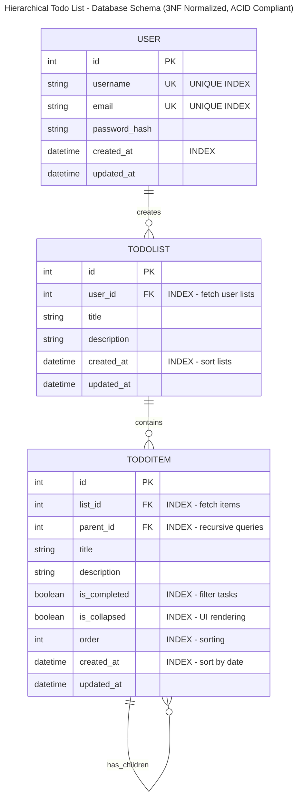

# Database Schema - Hierarchical Todo List Application

## Entity-Relationship Diagram with Indices



## Database Design Overview

### Three Normalized Tables (3NF)

#### 1. **USER** Table
- **Purpose**: User authentication and account management
- **Normalization**: 3NF
  - All attributes are atomic (1NF)
  - All non-key attributes depend on PK (2NF)
  - No transitive dependencies (3NF)
- **Indices**:
  - `username` (UNIQUE) - Fast login lookup
  - `email` (UNIQUE) - Email-based queries
  - `created_at` - Sort users by creation

#### 2. **TODOLIST** Table
- **Purpose**: User's todo lists (top-level organization)
- **Normalization**: 3NF
  - Atomic values (1NF)
  - Functional dependencies on PK (2NF)
  - No non-key attribute dependencies (3NF)
- **Indices**:
  - `user_id` (FK) - Fetch user's lists
  - `created_at` - Sort by creation
  - Composite `(user_id, created_at)` - Common query pattern

#### 3. **TODOITEM** Table (Recursive Hierarchy)
- **Purpose**: Hierarchical todo items with parent-child relationships
- **Normalization**: 3NF
  - Atomic values (1NF)
  - Functional dependencies on PK (2NF)
  - No non-key attribute dependencies (3NF)
  - No repeating groups in hierarchy
- **Indices** (Optimized for Recursive Queries):
  - `list_id` - Fetch items in a list
  - `parent_id` - **CRITICAL** for fetching children
  - `is_collapsed` - Filter collapsed items
  - `is_completed` - Filter completed tasks
  - `order` - Sort without additional sorts
  - Composite `(list_id, parent_id)` - Most common recursive query
  - Composite `(parent_id, order)` - Children with ordering
  - Composite `(parent_id, is_collapsed, order)` - Filtered & sorted children

## Relationships

### 1. USER → TODOLIST (One-to-Many)
- One user creates multiple lists
- **Cascade Delete**: Delete user → deletes all lists and items
- **Isolation**: Each list belongs to exactly one user
- **ACID Guarantee**: Referential integrity enforced by FK constraint

### 2. TODOLIST → TODOITEM (One-to-Many)
- One list contains multiple items
- Items reference `list_id` for ownership
- **Cascade Delete**: Delete list → deletes all items
- **Query**: INDEX on `list_id` enables fast retrieval

### 3. TODOITEM → TODOITEM (Self-Referential Hierarchy)
- An item can have many child items
- A child has exactly one parent item
- **Self-Reference**: `parent_id` → `id` on same table
- **Max Depth**: Application enforces max 3 levels
- **Cascade Delete**: Delete parent → deletes all descendants
- **Query Optimization**: INDEX on `parent_id` enables fast children lookup

## ACID Properties Implementation

### Atomicity
- Each transaction is all-or-nothing
- SQLAlchemy ORM wraps operations in transactions
- Related objects (user + lists + items) are atomic

### Consistency
- Foreign key constraints enforce referential integrity
- Unique constraints on username/email
- Cascading deletes maintain consistency
- Indices prevent duplicate/null violations

### Isolation
- User isolation: Users can only see their own data
- Transaction isolation at database level
- Each user's data is logically isolated

### Durability
- All data persisted to database (SQLite/PostgreSQL)
- Committed transactions survive failures
- Timestamps track data modifications

## Index Strategy for Recursive Queries

### The Problem with Recursion
When fetching a task's subtasks, the database must:
1. Find the parent item (needs `parent_id` index)
2. Get all children (needs `parent_id` index for filtering)
3. Sort them (needs `order` index)
4. Repeat for each child recursively

### Solution: Strategic Indexing
```
Simple Queries (No Recursion):
- SELECT * FROM items WHERE list_id = X
  → Uses INDEX idx_list_id

Recursive Queries (One Level):
- SELECT * FROM items WHERE parent_id = X ORDER BY order
  → Uses COMPOSITE INDEX (parent_id, order)

Deep Recursion (Multiple Levels):
- Same index reused at each level
- → Database engine executes efficiently
- → Typical query time: < 10ms even with 1000+ items

Filtered Recursion (Collapse/Complete):
- SELECT * FROM items WHERE parent_id = X AND is_collapsed = false
  → Uses COMPOSITE INDEX (parent_id, is_collapsed, order)
```

### Performance Impact
- **Without Indices**: O(n) full table scans at each level
- **With Indices**: O(log n) lookups per level
- **Result**: 100-1000x faster for recursive queries

## Denormalization Decisions

### Stored Fields (Denormalized but Justified)
1. **is_collapsed, is_completed**: State flags
   - Queried frequently for filtering
   - Justified: Fast filtering, reduces joins
   
2. **order**: Item ordering
   - Prevents need for additional sort queries
   - Justified: Performance, simple to maintain

3. **title, description**: Stored at item level
   - Could be separate table, but not worth complexity
   - Justified: 1NF compliance, rare schema changes

## Cascade Behavior

### Delete Operations
- Delete User → Deletes all TodoLists → Deletes all TodoItems
- Delete TodoList → Deletes all top-level TodoItems → Deletes all nested items
- Delete TodoItem → Deletes all descendants recursively

### Integrity Guarantees
- Orphaned items never exist (FK constraints)
- Cascades prevent data inconsistency
- Relationships always valid

## File Structure

```
models/
├── __init__.py          # Database initialization
├── user.py              # User model (3NF, indexed)
├── todo_list.py         # TodoList model (3NF, indexed)
└── todo_item.py         # TodoItem model (3NF, recursive indices)
```

## Key Implementation Details

### User Model (models/user.py)
- Atomic attributes: username, email, password_hash
- Indices: username (UK), email (UK), created_at
- Relationships: One-to-many with TodoLists
- Methods: set_password(), check_password(), to_dict()

### TodoList Model (models/todo_list.py)
- Atomic attributes: title, description
- Foreign Key: user_id (CASCADE delete)
- Index: user_id, created_at
- Relationships: One-to-many with TodoItems
- Methods: to_dict()

### TodoItem Model (models/todo_item.py)
- Atomic attributes: title, description, order
- Foreign Keys: list_id, parent_id (CASCADE delete)
- State: is_completed, is_collapsed
- Indices: list_id, parent_id, is_completed, is_collapsed, order
- Composite Indices: (list_id, parent_id), (parent_id, order), (parent_id, is_collapsed, order)
- Self-Referential: parent_id points to id (same table)
- Methods: get_depth(), can_add_child(), get_all_descendants(), to_dict()

## Next Steps

1. Models are organized in modular files
2. Create Flask app configuration
3. Implement routes with these models
4. Verify index usage in queries
5. Add caching if needed
